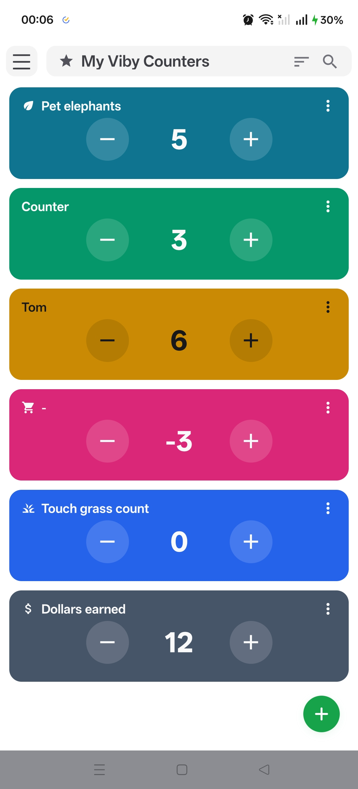
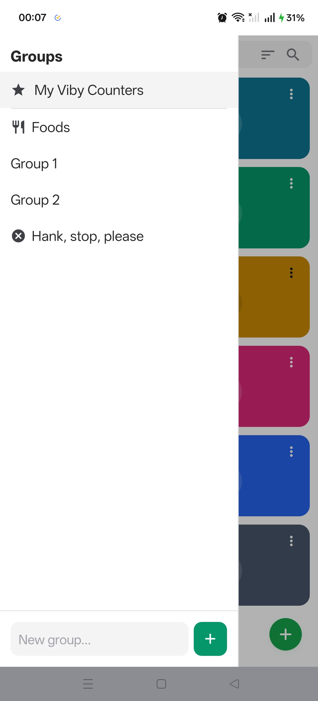
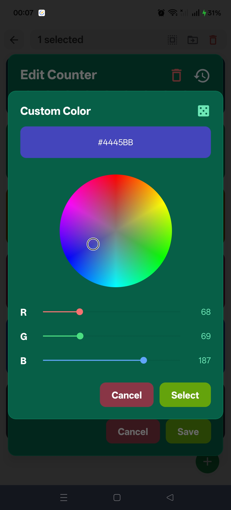
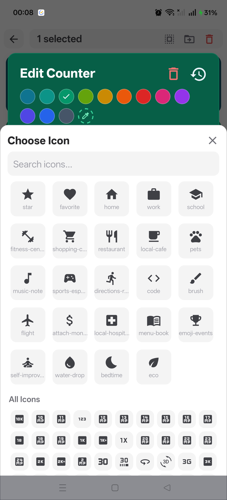

<p align="center">
  
</p>

<h1 align="center">VibyCounter</h1>

<p align="center">
  A sleek, customizable counter app for Android built with React Native & Expo.
  <br />
  Track anything — habits, reps, inventory, scores — with style.
</p>

<p align="center">
  
  
  
  
  
</p>

---

## Screenshots

<p align="center">
  
  
  
  
</p>

## Features

### Counters
- **Tap to increment/decrement** with haptic feedback
- **Fully customizable** — set name, color, icon, default value, increment & decrement steps
- **RGB color picker** with preset palette, interactive color wheel, and hex input
- **2000+ Material icons** with search and suggested picks
- **History tracking** — every increment, reset, and settings change is logged with timestamps
- **Reset to default value** with confirmation

### Groups
- **Organize counters** into named groups with custom icons
- **Drag-to-reorder** groups in the sidebar
- **Default group** always stays at the top
- **Move counters** between groups via quick actions or bulk selection

### Search & Sort
- **Animated search bar** — filter counters by name in real-time
- **Multiple sort modes** — by name, value, creation date, or last activity
- **Ascending/descending** toggle per sort field
- **Manual ordering** with drag-to-reorder when no sort is active

### Bulk Operations
- **Long-press to select** counters, then tap to add/remove from selection
- **Select all** visible counters in one tap
- **Bulk move** selected counters to another group
- **Bulk delete** with confirmation

### Polish
- **Adaptive text colors** — automatically switches between light/dark text based on counter background color
- **Smooth animations** — drawer slide, search transitions, validation toasts
- **Swipe-to-close** group drawer with gesture detection
- **Safe area handling** throughout
- **Persistent storage** — all data survives app restarts via MMKV

## Demo

https://github.com/user-attachments/assets/1104a908-cbc4-4694-bd7f-93bcb837641a

## Tech Stack

| Layer | Technology |
|-------|-----------|
| Framework | [Expo](https://expo.dev) (SDK 54, New Architecture) |
| Language | TypeScript |
| Styling | [NativeWind](https://www.nativewind.dev/) (Tailwind CSS for RN) |
| State | [Zustand](https://zustand-demo.pmnd.rs/) + [MMKV](https://github.com/mrousavy/react-native-mmkv) persistence |
| Animations | [React Native Reanimated](https://docs.swmansion.com/react-native-reanimated/) |
| Gestures | [React Native Gesture Handler](https://docs.swmansion.com/react-native-gesture-handler/) |
| Keyboard | [react-native-keyboard-controller](https://github.com/kirillzyusko/react-native-keyboard-controller) |
| Lists | [react-native-reorderable-list](https://github.com/omahili/react-native-reorderable-list), [@shopify/flash-list](https://shopify.github.io/flash-list/) |
| Icons | [@expo/vector-icons](https://icons.expo.fyi/) (MaterialIcons) |
| Haptics | [expo-haptics](https://docs.expo.dev/versions/latest/sdk/haptics/) |
| SVG | [react-native-svg](https://github.com/software-mansion/react-native-svg) |

## Getting Started

### Prerequisites

- [Node.js](https://nodejs.org/) 18+
- Android device or emulator
- [Expo CLI](https://docs.expo.dev/get-started/installation/)

### Installation

```bash
# Clone the repository
git clone https://github.com/YOUR_USERNAME/VibyCounter.git
cd VibyCounter

# Install dependencies
npm install

# Prebuild native project (required for native modules)
npx expo prebuild

# Run on connected Android device
npx expo run:android --device
```

> **Note:** This app uses native modules (MMKV, Reanimated, Gesture Handler, Keyboard Controller) and requires a development build. It will **not** run in Expo Go.

### Release Build

```bash
npx expo run:android --device --variant release
```

## Project Structure

```
├── app/
│   ├── _layout.tsx              # Root layout with providers
│   └── index.tsx                # Main screen
├── components/
│   ├── ActionsPopup.tsx         # Context menu for counter actions
│   ├── AddCounterModal.tsx      # New counter creation
│   ├── CounterCard.tsx          # Individual counter display
│   ├── CounterActionsMenu.tsx   # Three-dot menu trigger
│   ├── CounterHistoryModal.tsx  # History timeline view
│   ├── EditCounterModal.tsx     # Counter settings editor
│   ├── EditGroupModal.tsx       # Group settings editor
│   ├── GroupDrawer.tsx          # Sliding group sidebar
│   ├── IndexHeader.tsx          # Adaptive header bar
│   ├── MoveToGroupModal.tsx     # Group picker for moving
│   ├── SortModal.tsx            # Sort options sheet
│   └── reusable/
│       ├── ColorPickerBar.tsx   # Preset + custom color selector
│       ├── ColorWheel.tsx       # HSL color wheel with gestures
│       ├── ConfirmModal.tsx     # Generic confirmation dialog
│       ├── CounterSettingsFields.tsx  # Shared settings inputs
│       ├── CustomColorModal.tsx # RGB sliders + wheel + hex
│       ├── IconPickerModal.tsx  # Searchable icon browser
│       ├── ValidationToast.tsx  # Animated error toast
│       └── VibyInput.tsx        # Enhanced TextInput wrapper
├── hooks/
│   ├── useSearch.ts             # Search state & animations
│   ├── useSelection.ts         # Multi-select logic
│   └── useSort.ts              # Sort field & direction
├── shop/
│   └── counterShop.ts          # Zustand store with MMKV
└── vibes/
    └── definitions.ts           # Types, constants, utilities
```

## Architecture Decisions

**Zustand + MMKV** was chosen over AsyncStorage for synchronous reads and significantly faster serialization. The entire store persists automatically.

**Custom drawer over expo-router drawer** because the group sidebar is a filter/selector, not navigation. A navigation drawer would force each group into a separate route, which is architecturally wrong for this use case.

**react-native-reorderable-list over react-native-draggable-flatlist** due to layout glitches with the latter inside an animated drawer. The gesture systems conflicted, causing items to flash at wrong positions after reordering.

**Generated BMP color wheel** instead of SVG segments to achieve a smooth, continuous gradient. The bitmap is generated once and cached for the app lifetime.

**FlashList for the icon picker** to handle 2000+ icons without performance degradation. Memoized item components and debounced search keep renders under 20ms.

## License

This project is licensed under the MIT License — see the [LICENSE](LICENSE) file for details.

---

<p align="center">
  Built with ☕ and Expo
</p>
